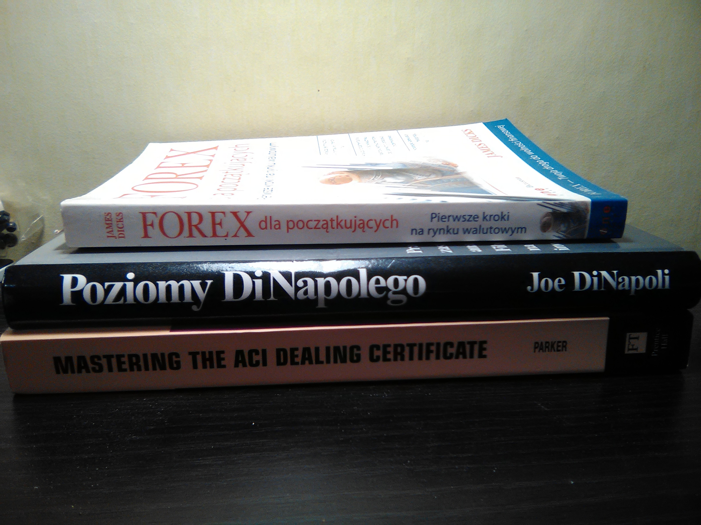

# quant-terminal

## Terminal for stock markets and forex quantitative analysis.

## Data sources:

* Free APIs 
* Web crawlers
* csv files

## Project key objectives
* it will probably look like Bloomberg Terminal
* Python GUI or Golang CLI or C++ with https://github.com/ocornut/imgui 
* learn and apply quantitative techniques
* apply computer vision for stock pattern recognition
* apply NLP for news and economic calendar

Maybe I'll reuse old books I bought back in 2007 when
I started my journey with stock markets and forex.

